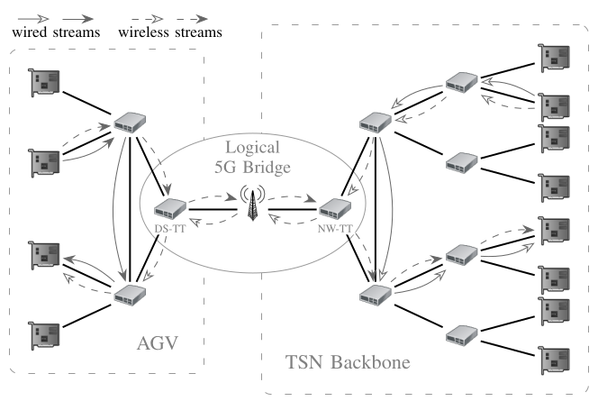

# libtsndgm

# Docker/Podman Setup
This is the recommended way of deployment if you want to reproduce the evaluation results and your compiler does not support C++23.
Start by building the image via:
```bash
$ podman built -t libtsndgm .
```
this will download the latest gcc docker image, install the required packages, and setup a python virtual environment.
You can then open a shell in the container with
```bash
$ podman -v .:/usr/src/libtsndgm -it libtsndgm
```

# Building the Project 
In case you have trouble building C++23 projects in general, please refer to the [detailed building guide](documentation/build.md).

Build the project (directly or after the above docker setup) with its test cases and benchmarks via:
```bash
$ mkdir release && cd release
$ cmake ..
$ make -j
```

# Reproduce the Evaluation Results
## Scalability results
```bash
$ podman -v .:/usr/src/libtsndgm -it libtsndgm
/usr/src# cd libtsndgm
/usr/src/libtsndgm# python scripts/scalability.py
```

## Simulation results
```bash
$ podman -v .:/usr/src/libtsndgm -it libtsndgm
/usr/src# source omnetpp/omnetpp/setenv
/usr/src# cd libtsndgm
/usr/src/libtsndgm# python scripts/simulation.py
```

# Quick Library Usage Tutorial
## Building a Network and Initializing TSN Streams
We provide a helper script that builds and simple network of an automated guided vehicle (AGV) use case.
```bash
# Show help menu 
python scripts/agv_network_builder.py -h

# Example with 10 uplink/downlink streams and 5+5 internal streams
python scripts/agv_network_builder.py -agv_wt_out 10 -agv_wt_in 10 -agv_ct 5 -core_ct 0
```
This will produce the following network:



By default, the resulting network.json and streams.json file will be stored in *./data*.
Loading the network and streams in *libtsndgm* is then as simple as calling:
```cpp
  auto network = NetworkTopology(network_file);
  auto stream_storage = StreamStorage(stream_file, network);
```
If, however, you are interested in building custom networks and streams, please review the source files in *./tests*. 

## Running the Heuristics and Deriving the TSN Configuration
We currently support incremental heuristics that add one stream to an existing TSN schedule at a time. 
```cpp
  IncrementalHeuristic heuristic(&stream_storage, &network);
  for (StreamId id = 0; id < stream_storage.streams.size(); id++) {
    auto accepted = heuristic.add_stream(id);
    std::println("Result: {} {}", stream_storage.streams[id].name, accepted);
  }
  auto g = std::move(heuristic.g);
```
Alternative initial heuristics are defined in *src/heuristic/initial/initial.h*.

The TSN configuration (GCLs, PSFP configuration, and additional metadata) can be computed as follows:
```cpp
  auto tsn_configuration = g.derive_tsn_configuration();
  tsn_configuration.add_meta_data("field", "value");
  tsn_configuration.dump_to_file(tsn_config_file);
```
